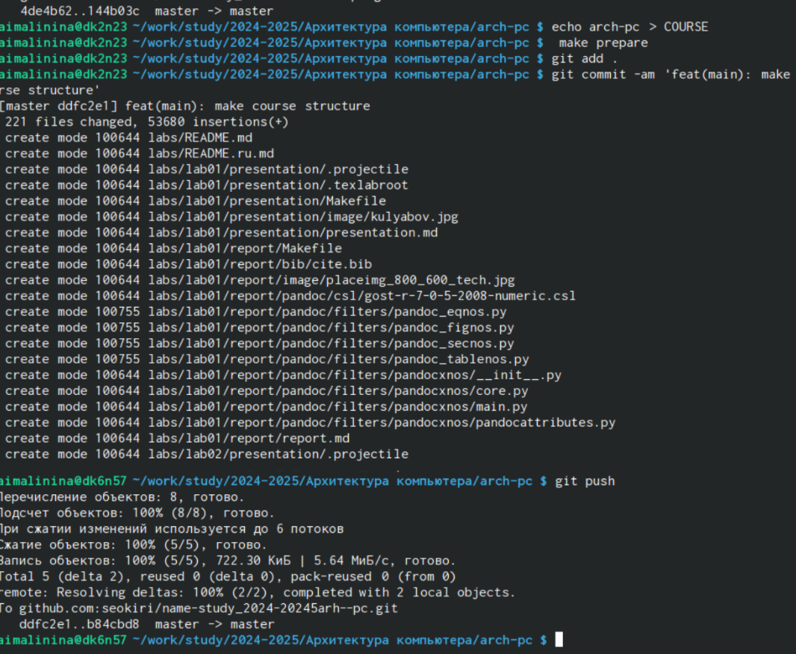

---
## Front matter
title: "Отчёт по лабораторной работе №2"
subtitle: "Дисциплина: архитектура компьютера"
author: "Малинина Анастасия Игоревна"

## Generic otions
lang: ru-RU
toc-title: "Содержание"

## Bibliography
bibliography: bib/cite.bib
csl: pandoc/csl/gost-r-7-0-5-2008-numeric.csl

## Pdf output format
toc: true # Table of contents
toc-depth: 2
lof: true # List of figures
lot: true # List of tables
fontsize: 12pt
linestretch: 1.5
papersize: a4
documentclass: scrreprt
## I18n polyglossia
polyglossia-lang:
  name: russian
  options:
	- spelling=modern
	- babelshorthands=true
polyglossia-otherlangs:
  name: english
## I18n babel
babel-lang: russian
babel-otherlangs: english
## Fonts
mainfont: IBM Plex Serif
romanfont: IBM Plex Serif
sansfont: IBM Plex Sans
monofont: IBM Plex Mono
mathfont: STIX Two Math
mainfontoptions: Ligatures=Common,Ligatures=TeX,Scale=0.94
romanfontoptions: Ligatures=Common,Ligatures=TeX,Scale=0.94
sansfontoptions: Ligatures=Common,Ligatures=TeX,Scale=MatchLowercase,Scale=0.94
monofontoptions: Scale=MatchLowercase,Scale=0.94,FakeStretch=0.9
mathfontoptions:
## Biblatex
biblatex: true
biblio-style: "gost-numeric"
biblatexoptions:
  - parentracker=true
  - backend=biber
  - hyperref=auto
  - language=auto
  - autolang=other*
  - citestyle=gost-numeric
## Pandoc-crossref LaTeX customization
figureTitle: "Рис."
tableTitle: "Таблица"
listingTitle: "Листинг"
lofTitle: "Список иллюстраций"
lotTitle: "Список таблиц"
lolTitle: "Листинги"
## Misc options
indent: true
header-includes:
  - \usepackage{indentfirst}
  - \usepackage{float} # keep figures where there are in the text
  - \floatplacement{figure}{H} # keep figures where there are in the text
---

# Цель работы

Целью данной лабораторной работы является получение практических
навыков работы с системой Git при помощи командной строки. В ходе неё мы я
изучить идеологию и применение средств контроля версий.

# Задание

1. Настройка github.
2. Базовая настройка git.
3. Создание SSH ключа.
4. Создание рабочего пространства и репозитория курса на основе шаблона.
5. Создание репозитория курса на основе шаблона.
6. Настройка каталога курса.
7. Выполнение заданий для самостоятельной работы.

# Выполнение лабораторной работы

Создаем учетную запись на сайте Github. (рис. [-@fig:001])
{#fig:001 width=70%}

Открываем терминал, делаю конфигурацию git. Вводим команду git config --global
user.name и указываем имя, следом вводим git config --global user.email, вписывая
электронную почту аккаунта github. Настраиваем utf- в выводе сообщений git. Задаем имя
для начальной ветки. Она будет называться «master». Задаем параметры autocrlf и safecrlf
для корректного выполнения команд. (рис. [-@fig:002])
{#fig:001 width=70%}

Для последующей идентификации пользователя на сервере репозиториев
необходимо сгенерировать пару ключей (приватный и открытый). Для этого вводим в
командную строку команду ssh-keygen –C “”, вводя имя пользователя и электронную почту.
(рис. [-@fig:003])
{#fig:001 width=70%}

Загружаем сгенеренный открытый ключ. Заходим на сайт под своей учетной записью,
переходим в меню, находим меню ключей и создаем новый ключ. (рис. [-@fig:004])
{#fig:001 width=70%}

Копируем из локальной консоли ключ в буфер обмена и используем команду cat. (рис. [-@fig:005])
{#fig:001 width=70%}

Вставляем ключ в поле сайта и указываем имя для ключа. (рис. [-@fig:006])
{#fig:001 width=70%}

Создание рабочего пространства и репозитория курса на основе шаблона.
Открываем терминал и создаем каталог для предмета “Архитектура компьютера”. (рис. [-@fig:007])
{#fig:001 width=70%}

Создание репозитория курса на основе шаблона. Переходим на станицу github в репозиторий с шаблоном курса https://github.com/yamadharma/cour se-directory-studenttemplate. Далее выбираем “Use this template”. В открывшемся окне задаем имя репозитория. Создаем репозиторий. Проверяем создался ли репозиторий. (рис. [-@fig:008])
{#fig:001 width=70%}

Открываем терминал и переходим в каталог курса при помощи cd и клонируем
созданный репозиторий и помощи команды git clone –recursive ‘’. (рис. [-@fig:009])
{#fig:001 width=70%}

Копируем ссылку для клонирования на странице созданного репозитория. Переходим в
окно Code, следом в SSH. (рис. [-@fig:0010])
{#fig:001 width=70%}

Настройка каталога курса. Переходим в каталог курса при помощи cd. Удаляем
лишние файлы. (рис. [-@fig:0011])
{#fig:001 width=70%}

Создаем необходимые каталоги. Отправляем файлы на сервер используя команды
git add ., git commit –am и git push. (рис. [-@fig:0012])
{#fig:001 width=70%}

Проверяем правильность создания иерархии рабочего пространства в локальном
репозитории и на странице github. (рис. [-@fig:0013])
{#fig:001 width=70%}

# Выполнение заданий для самостоятельной работы

Переходим в labs/lab02/report с помощью cd. Создаем файл для отчета по
лабораторной работе, копируем первую лабораторную с помощью и проверяем
правильность выполнения команды. Переходим в подкаталог lab02/report. Копируем
вторую лабораторную в каталог. (рис. [-@fig:0014])
{#fig:001 width=70%}

При помощи команды git add ‘’ добавляем новые файлы. Сохраняем изменение при помощи
команды git commit – am. Переносим в репозиторий сохраненные изменения командой git
push.  (рис. [-@fig:0015])
{#fig:001 width=70%}

Проверяем на сайте правильность выполнения заданий. (рис. [-@fig:0016])
{#fig:001 width=70%}

# Выводы

При выполнении данной лабораторной работы мы приобрели практические
навыки по работе с системой git, создали репозиторий курса.

# Список литературы{.unnumbered}

::: {#refs}
:::
